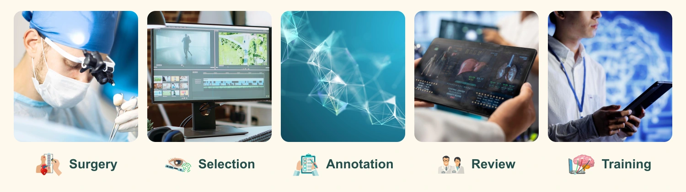

# Yasargil



Yasargil turns surgical images into draft annotations and multimodal training
conversations. Qwen writes the drafts, MedGemma reviews them, and each run saves
the source evidence and model responses for human review.

The first supported dataset is **SOSpine**, images of simulated spinal durotomy
repair on cadavers. Original tool labels and coordinates stay separate from new
model-generated descriptions.

**Experimental research software.** Outputs require expert review and have not
been validated for clinical use or live surgical guidance.

## Setup

Run commands from the repository root. The project uses Python 3.12 and `uv`.

```bash
uv sync --frozen
uv run yasargil --help
```

Before running inference:

1. Download SOSpine and follow the [dataset setup guide](docs/DATA_SOURCES.md).
   Keep source data and generated outputs out of Git.
2. Install the pinned llama.cpp runtime and matching Qwen and MedGemma models
   and vision projectors using the [local inference guide](docs/LLAMA_CPP.md).
3. Run `uv run yasargil models` to check the installed files. This does not download
   weights or run inference.

Datasets, model weights, and the inference runtime are not bundled.

## Choose a workflow

**Video selection and annotation:** DINO proposes candidate frames. Qwen keeps or
drops candidates using the complete video, then a separate pass annotates the
selected frames. MedGemma reviews the selected stills and drafts.

Install the [DINO weights](docs/SMART_FRAME_SELECTION.md#encoder-setup-and-selection),
then select frames from a video:

```bash
uv sync --extra selection
uv run --extra selection yasargil select-video-frames \
  --input '/path/to/surgery.mp4' \
  --output-dir outputs/selection-example
```

Open the generated `selection.html` to review the selection. Follow the guides for
[SOSpine image sequences](docs/SMART_FRAME_SELECTION.md),
[annotation](docs/FRAME_ANNOTATION.md), and
[MedGemma review](docs/MEDGEMMA_FRAME_REVIEW.md).

**Bounded enhancement:** Qwen and MedGemma inspect a small window of SOSpine
images and original CSV labels, requesting more frames within set budgets.
This is a separate workflow from video annotation.

```bash
uv run yasargil enhance-sospine \
  --dataset-root '/path/to/datasets/SOSpine' \
  --case-id S1A2 --start-index 1 --cutoff-index 12 \
  --initial-frames 4 --search-frames 4 --max-frames 8 \
  --output-dir outputs/enhancement-example
```

Use a new output directory outside the source dataset. Add `--dry-run` to preview
without writes or model calls. A completed run saves an evidence archive, model
requests and responses, and a human-review packet. See the
[enhancement guide](docs/ENHANCEMENT.md) for batch runs and pause/resume.

## Inspect saved results

For saved video selections, annotations, and MedGemma reviews:

```bash
uv run yasargil inspect-dataset
```

Open [localhost:8765](http://127.0.0.1:8765) to browse frames, model annotations,
source labels, and outcomes. See the [inspector guide](docs/DATASET_INSPECTOR.md)
for review notes and exports.

## Research status and known limitations

- Generated timestamps can be wrong, and full-video requests are expensive.
- Early MedGemma reviews made few substantive corrections. Model agreement does
  not establish correctness.
- SOSpine provides sampled images; reconstructed video timing does not recover
  original acquisition timestamps or missing motion.
- Completing a run does not approve its output for training. Human review,
  eligibility checks, and surgeon-disjoint splits are required. Importing completed
  reviews, expert evaluation, and student GPU training remain pending.

See [video validation limits](docs/LLAMA_CPP.md#integrity-and-validation-limits)
and the [review protocol](docs/MEDGEMMA_FRAME_REVIEW.md).

## More guides

- [Selection batches](docs/SELECTION_BATCH.md) and [gap experiments](docs/GAP_EXPERIMENT.md)
- [Dataset format and export rules](docs/DATASET_CONTRACT.md)
- [Human review and evaluation](docs/REVIEW_AND_EVALUATION.md)
- [Training with Unsloth](docs/TRAINING.md)

## Development

```bash
uv run python -B -m unittest discover -s tests -v
node --test tests/test_review_ui.js
python3 scripts/check_repo_hygiene.py
```

Run `python3 scripts/check_repo_hygiene.py --staged` after staging changes.

## License

Original code, schemas, tests, and documentation use [Apache 2.0](LICENSE).
Copyright 2026 Yasargil contributors.

Datasets, model weights, and external runtimes retain their own terms. SOSpine's
conflicting license notices are documented in [Data sources](docs/DATA_SOURCES.md).

The banner uses illustrative stock images, not SOSpine frames. Its assets follow
[Magnific's terms](https://www.magnific.com/ai/docs/licenses-attribution) and are
excluded from the Apache license.

<details>
<summary>Banner image and icon credits</summary>

Artwork sourced through Magnific:

- Surgery: [microsurgeon photograph](https://www.magnific.com/premium-photo/doctor-microsurgeon-works-operating-room-glasses-microscope-with-lenses-neurosurgical-ope_24363828.htm) by velimirisaevich.
- Selection: [video-editing workstation](https://www.magnific.com/free-photo/empty-office-workspace-with-dual-monitors-displaying-video-editing-timeline_417839803.htm) by DC Studio.
- Annotation: [network visualization](https://www.magnific.com/free-photo/3d-render-low-poly-plexus-design-with-shallow-depth-field_23592892.htm) by kjpargeter.
- Review: [medical image review](https://www.magnific.com/free-photo/medic-expert-analyzing-ct-scan-result-examine-organs-condition_410109349.htm) by DC Studio.
- Training: [AI systems photograph](https://www.magnific.com/free-photo/it-admin-does-ai-systems-checkup_190323443.htm) by DC Studio.
- Icons: [scientific icon collection](https://www.magnific.com/free-vector/flat-color-scientific-icons-set-biotechnology-genetic-engineering-nanotechnology-isolated-vector-illustration_4411606.htm) by macrovector_official.

</details>
