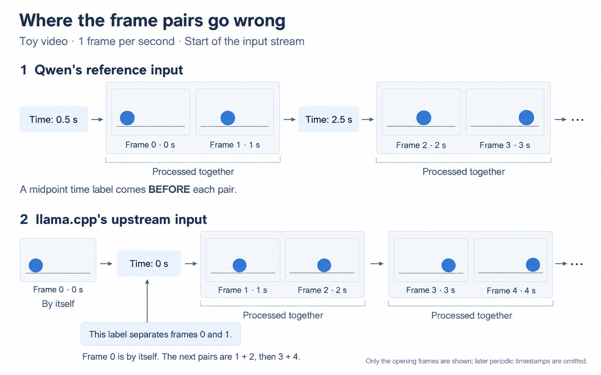

# How Qwen3.8-27B understands video

Ollama, why is your video support for Qwen3.8 still a TODO comment? [`// TODO: support videos`](https://github.com/ollama/ollama/blob/5a0ff3116d7d1aff28cd7a390783d809f69f0b6c/model/renderers/qwen35.go#L86).

As of 23 September 2026, its [media handling](https://github.com/ollama/ollama/blob/5a0ff3116d7d1aff28cd7a390783d809f69f0b6c/llm/media.go#L17-L24) recognizes images and audio, but still has no supported native video input. The [proposed video implementation](https://github.com/ollama/ollama/pull/12962) remains open and unmerged. The [advice in the GitHub issue](https://github.com/ollama/ollama/issues/10971#issuecomment-3009469523) was to extract the frames and feed them through the image processor. Okay, but what then is the point of using a video-native model for annotations?

Fine. Ollama is for noobs and I always liked llama.cpp better anyway. Then I start looking at the timestamps in those answers after switching to llama.cpp and the timestamps are stretching beyond the duration of video inputs. 

So what does it mean when a model is video-native? ELI5:

[Qwen3.8-27B](https://huggingface.co/Qwen/Qwen3.8-27B) has a vision encoder working with its language model. It can use pictures, their order, and their timing to answer a question. The software running it still has to open the video file and prep that input. “Video native” does not make that step go away as I hoped. Apparently I needed to learn this personally.

Let's give the model a short clip where a ball rolls across the floor. We ask: **“Which way did the ball move?”**

The software opens the video and decodes its pictures, called **frames**. It then selects frames to send to Qwen. For this example, say we take one picture per second. A lot can happen between those pictures. Qwen only gets the ones we send.

For this model, the selected frames are processed in pairs. Each pair gets a time label **before** it:

```text
<0.5 seconds> → [picture at 0 s][picture at 1 s]
<2.5 seconds> → [picture at 2 s][picture at 3 s]
```

The `0.5` is the midpoint of the first two times: `(0 + 1) / 2`. Both pictures go into the model. We averaged their times, not the pictures. These are neighboring frames in our selected sequence; they might have been much farther apart in the original file. The [reference processor calculates the labels from their source-frame positions](https://github.com/huggingface/transformers/blob/v5.8.0/src/transformers/models/qwen3_vl/processing_qwen3_vl.py#L235-L246).

Now we have to turn the pictures into something the language model can use.

Each picture is divided into little squares called **patches**. Qwen3.8-27B uses 16 × 16 pixel patches, processes two selected frames together, and combines nearby patch features. Those details are in [the model's configuration](https://huggingface.co/Qwen/Qwen3.8-27B/blob/main/config.json).

The **vision encoder** processes those patches. The **projector** converts its output into the numerical format the language model uses. We call the resulting pieces **visual tokens**. Think lists of numbers carrying information from the pictures.


The grid is enlarged and the numbers are made up for the drawing. There isn't a tiny caption saying “ball” inside each square. During training, the model learned patterns in visual information and how they relate to language.

So now Qwen has information from the pictures, their time and order, and our question. The ball is on the left in the earlier pictures and farther right in the later ones. There is evidence it moved right.


Okay. Back to the timestamp code I hadn't planned on reading.

The [video support added to llama.cpp](https://github.com/ggml-org/llama.cpp/pull/24269) used a general prompt format for different models. In the upstream code I checked on 23 September 2026, the [video helper puts periodic timestamp text after frames](https://github.com/ggml-org/llama.cpp/blob/4ceb1719101f32637b841206c172f3f058ffc182/tools/mtmd/mtmd-helper.cpp#L802-L845). The [pairing code only joins image parts that are directly next to each other](https://github.com/ggml-org/llama.cpp/blob/4ceb1719101f32637b841206c172f3f058ffc182/tools/mtmd/mtmd.cpp#L1100-L1116).

**The mismatch was in llama.cpp's video input preparation.** It put the first time label between frames 0 and 1. The pairing code cannot join two pictures across a piece of text, so frame 0 was processed by itself. The next pairs became **1 + 2**, then **3 + 4**, until another timestamp interrupted the sequence.

Qwen's reference processor pairs **0 + 1**, then **2 + 3**, and puts a midpoint time label before each pair. In our one-frame-per-second example, that means **0.5 seconds → frames 0 + 1**, then **2.5 seconds → frames 2 + 3**. Same pictures, different pairs and time labels:



I patched llama.cpp to keep the intended pairs together and put each pair's midpoint time before it. That fixes the input layout. I rerun the full keyframe selection review thing and the model still fucks up timeframes so... WTF. TBC.
