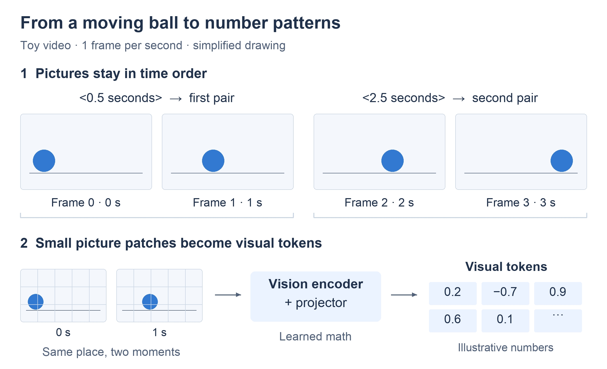
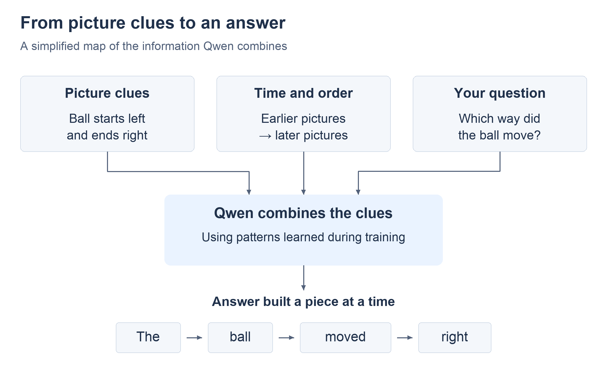

# How Qwen3.8-27B understands video (ELI5)

Ollama, why is your video support for Qwen3.8 still a TODO comment? [`// TODO: support videos`](https://github.com/ollama/ollama/blob/5a0ff3116d7d1aff28cd7a390783d809f69f0b6c/model/renderers/qwen35.go#L86). (Qwen3.8 reuses Qwen3.5's architecture, hence the file name.)

As of 23 September 2026, its [media handling](https://github.com/ollama/ollama/blob/5a0ff3116d7d1aff28cd7a390783d809f69f0b6c/llm/media.go#L17-L24) knows images and audio, not video. The [video PR](https://github.com/ollama/ollama/pull/12962) is still open and unmerged, and the [advice in the issue](https://github.com/ollama/ollama/issues/10971#issuecomment-3009469523) was to extract the frames and feed them as images. Then what is the point of a video-native model?

Fine, Ollama is for noobs and I always liked llama.cpp anyway. Then the timestamps in its responses answers ran past the end of test clips with llama.cpp's default vision handling. To debug that I had to learn what 'video-native' means so what does that mean? ELI5:

## 1. The model never sees a video file

'Video-native' means the model was trained to read *frames in order, with time labels*. Opening the `.mp4` is still your job in 2026.

Test clip: a ball rolls across the floor. Question: **"Which way did the ball move?"**

## 2. How the pictures get packed

**Step 1: pairs, each with a time label.** [Qwen3.8-27B](https://huggingface.co/Qwen/Qwen3.8-27B) reads frames two at a time. Before each pair goes a text label with the *average* of the two times. With one frame per second:



```text
<0.5 seconds> [frames 0 s and 1 s, as one block]
<2.5 seconds> [frames 2 s and 3 s, as one block]
```

`0.5` is `(0 + 1) / 2`. The times get averaged; the pictures do not. Both go in; the model learned how to combine them. The [reference processor](https://github.com/huggingface/transformers/blob/v5.8.0/src/transformers/models/qwen3_vl/processing_qwen3_vl.py#L257-L268) computes each label from where the frame sat in the original file, so neighbours in your selection can be far apart in the video.

**Step 2: patches.** Each picture is cut into little squares called **patches**, 16 × 16 pixels each (`patch_size` in the [model config](https://huggingface.co/Qwen/Qwen3.8-27B/blob/main/config.json)).

**Step 3: numbers.** The **vision encoder** reads both frames of a pair together and emits are patch embeddings. The **projector** merges every 2 × 2 block of those lists into one list of the size the language model uses (`temporal_patch_size` and `spatial_merge_size` in the config). Each one is a **visual token** and not tiny caption saying "ball".

The input is now one line: label, visual tokens, label, visual tokens, question. Remember the time label is plain text sitting between image frames and not designated to a specific frame. **The time label marks the midpoint of the frame pair.**

## 3. How it answers

The ball's visual tokens sit further right in the later block, and the labels say which block is later.



Add the question, and that is enough to write "The ball moved right", one token at a time.

## 4. The bug in llama.cpp's packing

llama.cpp [added video input](https://github.com/ggml-org/llama.cpp/pull/24269) with a prompt format meant to fit any model. Its [video helper](https://github.com/ggml-org/llama.cpp/blob/4ceb1719101f32637b841206c172f3f058ffc182/tools/mtmd/mtmd-helper.cpp#L802-L845) writes a timestamp as plain text *after* a frame, every 5 seconds by default, starting at 0. Its [pairing rule](https://github.com/ggml-org/llama.cpp/blob/4ceb1719101f32637b841206c172f3f058ffc182/tools/mtmd/mtmd.cpp#L1100-L1116) joins two pictures only when they touch in the line. Text between them breaks the pair.

Same pictures, different pairs and labels:


So the line starts `Video:`, frame 0, `[0m0.00s]`, frame 1, frame 2, ... Frame 0 is alone, the pairs become **1 + 2** and **3 + 4**, frame 5 is orphaned by the next timestamp, and so on. Every pair shifts by one; every label is misplaced and in the wrong format. Qwen expects **0 + 1** and **2 + 3**, each with its midpoint label in front.

I patched llama.cpp to keep Qwen's pairs together and put each pair's midpoint label before it. That fixes the layout.

I reran the full keyframe selection review and the model still gets timestamps wrong, so... WTF. TBC.
